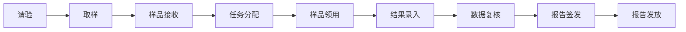
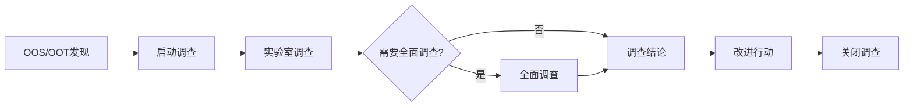
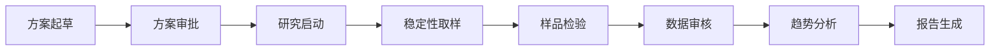

# 农药生产企业分析实验室LIMS系统 - 产品需求文档

## 1. 产品概述

农药生产企业分析实验室信息管理系统（LIMS），实现检验检测活动的电子化、标准化和可追溯管理。
- 满足农药产品质量控制、检验检测、稳定性研究等业务需求
- 符合CNAS认可准则、GMP规范及相关国家标准要求
- 支持B/S架构，PC端和移动端均可访问

## 2. 核心功能

### 2.1 用户角色

| 角色 | 登录方式 | 核心权限 |
|------|----------|----------|
| 系统管理员 | 用户名+密码 | 系统配置、用户管理、权限分配 |
| 检验员 | 用户名+密码 | 样品接收、结果录入、数据查询 |
| 审核员 | 用户名+密码 | 数据复核、审核意见记录 |
| 批准人 | 用户名+密码 | 报告签发、最终审批 |
| 质量负责人 | 用户名+密码 | 质量监控、偏差调查 |

### 2.2 功能模块

1. **登录页**：用户身份认证、密码找回
2. **仪表盘**：待办任务、预警信息、快捷入口、数据统计
3. **样品管理**：请验、取样、接收、分发、留样
4. **检验管理**：任务分配、结果录入、数据复核、报告管理
5. **稳定性管理**：方案管理、取样提醒、趋势分析
6. **环境监测**：监测计划、样品登记、结果录入
7. **偏差调查**：OOS/OOT/AD调查流程
8. **资源管理**：物料、仪器、试剂、人员、方法
9. **系统管理**：用户、权限、日志、配置

### 2.3 页面详情

| 页面名称 | 模块名称 | 功能描述 |
|----------|----------|----------|
| 登录页 | 身份认证 | 用户名密码登录、记住密码、密码找回 |
| 仪表盘 | 工作台 | 待办任务列表、预警通知、快捷操作入口、统计卡片 |
| 请验管理 | 样品管理 | 请验单创建、编辑、提交、打印、状态跟踪 |
| 样品接收 | 样品管理 | 扫码/手动接收、批量接收、样品分发 |
| 检验任务 | 检验管理 | 任务列表、任务分配、优先级管理 |
| 结果录入 | 检验管理 | 手工录入、自动计算、OOS判断、仪器数据导入 |
| 数据复核 | 检验管理 | 结果审核、意见记录、退回修改 |
| 检验报告 | 报告管理 | 报告生成、多级审核、电子签章、打印导出 |
| 稳定性方案 | 稳定性管理 | 方案起草、审批、发布、修订 |
| 稳定性取样 | 稳定性管理 | 取样提醒、取样记录、标签打印 |
| 环境监测计划 | 环境监测 | 计划编制、周期管理、采样点设置 |
| 环境样结果 | 环境监测 | 结果录入、审核发布、趋势分析 |
| 偏差调查 | 质量管理 | 调查启动、实验室调查、全面调查、结论报告 |
| 物料管理 | 资源管理 | 物料台账、库存管理、有效期预警 |
| 仪器设备 | 资源管理 | 设备台账、校准维护、使用日志 |
| 试剂耗材 | 资源管理 | 入库领用、有效期预警、低库存预警 |
| 人员管理 | 资源管理 | 人员档案、培训记录、上岗证、资质提醒 |
| 方法管理 | 资源管理 | 方法库、版本控制、验证记录 |
| 用户管理 | 系统管理 | 用户增删改查、角色分配、状态管理 |
| 权限管理 | 系统管理 | 角色定义、菜单权限、数据权限 |
| 系统日志 | 系统管理 | 操作日志、登录日志、审计追踪 |

## 3. 核心流程

### 3.1 检验业务流程

### 3.2 偏差调查流程

### 3.3 稳定性研究流程

## 4. 用户界面设计

### 4.1 设计风格

- **主色调**：深青色(#0f766e)为主色，搭配浅灰色(#f8fafc)背景
- **辅助色**：琥珀色(#f59e0b)用于警告，红色(#ef4444)用于错误
- **按钮样式**：圆角矩形，主按钮填充色，次按钮描边
- **字体**：系统默认字体，标题加粗，正文常规
- **布局**：左侧固定导航栏 + 右侧内容区，卡片式布局
- **图标**：使用 lucide-react 图标库

### 4.2 页面设计概览

| 页面名称 | 模块名称 | UI元素 |
|----------|----------|--------|
| 登录页 | 认证表单 | 居中卡片、Logo、输入框、按钮、背景渐变 |
| 仪表盘 | 工作台 | 统计卡片、待办列表、预警通知、快捷入口 |
| 列表页 | 数据表格 | 搜索栏、筛选条件、表格、分页、操作按钮 |
| 表单页 | 数据录入 | 表单字段、验证提示、保存提交按钮 |
| 详情页 | 数据展示 | 信息卡片、状态标签、操作记录、审核流程 |
| 报告页 | 报告展示 | 报告模板、电子签章、打印预览、PDF导出 |

### 4.3 响应式设计

- **桌面端**：左侧导航展开，完整表格展示，多列布局
- **平板端**：左侧导航收起为图标，表格横向滚动
- **移动端**：底部标签导航，卡片式列表，单列布局，触摸优化

## 5. 数据库设计

### 5.1 核心数据表

- 用户表(users)、角色表(roles)、权限表(permissions)
- 物料表(materials)、供应商表(suppliers)
- 仪器设备表(instruments)、校准记录表(calibration_records)
- 试剂表(reagents)、标准物质表(reference_materials)
- 检测方法表(methods)、方法版本表(method_versions)
- 请验单表(inspection_requests)、样品表(samples)
- 检验任务表(inspection_tasks)、检验结果表(inspection_results)
- 检验报告表(inspection_reports)、报告审核记录表(report_approvals)
- 稳定性方案表(stability_protocols)、稳定性研究表(stability_studies)
- 环境监测计划表(environmental_plans)、环境样品表(environmental_samples)
- 偏差调查表(deviation_investigations)、调查记录表(investigation_records)
- 系统日志表(system_logs)、审计追踪表(audit_trails)

## 6. 技术栈

- **前端**：React 18 + TypeScript + Tailwind CSS + Ant Design Mobile
- **后端**：Node.js + Express + TypeScript
- **数据库**：MySQL (端口3307)
- **状态管理**：Zustand
- **路由**：React Router
- **图表**：ECharts
- **HTTP客户端**：Axios
