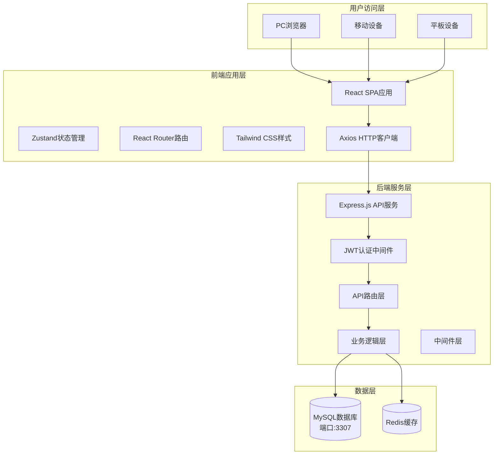
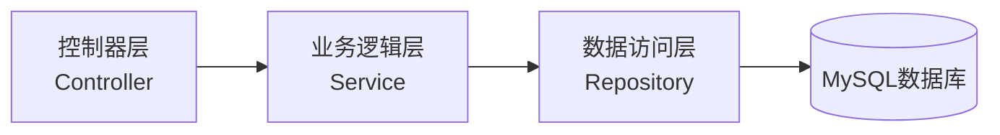
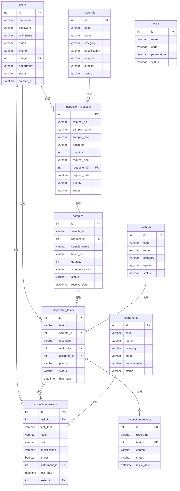

# 农药生产企业分析实验室LIMS系统 - 技术架构文档

## 1. 架构设计



## 2. 技术描述

- **前端框架**: React 18 + TypeScript
- **构建工具**: Vite
- **UI框架**: Tailwind CSS + shadcn/ui
- **状态管理**: Zustand
- **路由**: React Router v6
- **HTTP客户端**: Axios
- **图表库**: ECharts
- **图标库**: lucide-react
- **后端框架**: Express.js + TypeScript
- **数据库**: MySQL (端口3307, 账号root, 密码lvba123456)
- **ORM**: 原生SQL + mysql2驱动
- **认证**: JWT (jsonwebtoken)
- **密码加密**: bcryptjs
- **数据验证**: express-validator

## 3. 路由定义

### 3.1 前端路由

| 路由 | 用途 | 权限 |
|------|------|------|
| /login | 登录页面 | 公开 |
| /dashboard | 仪表盘工作台 | 所有角色 |
| /samples/request | 请验管理 | 检验员及以上 |
| /samples/receive | 样品接收 | 检验员及以上 |
| /inspection/tasks | 检验任务 | 检验员及以上 |
| /inspection/entry | 结果录入 | 检验员及以上 |
| /inspection/review | 数据复核 | 审核员及以上 |
| /inspection/reports | 检验报告 | 所有角色 |
| /stability/protocols | 稳定性方案 | 质量负责人 |
| /stability/sampling | 稳定性取样 | 检验员及以上 |
| /environment/plans | 环境监测计划 | 质量负责人 |
| /environment/results | 环境样结果 | 检验员及以上 |
| /deviation/list | 偏差调查 | 质量负责人 |
| /resources/materials | 物料管理 | 所有角色 |
| /resources/instruments | 仪器设备 | 所有角色 |
| /resources/reagents | 试剂耗材 | 所有角色 |
| /resources/personnel | 人员管理 | 所有角色 |
| /resources/methods | 方法管理 | 所有角色 |
| /system/users | 用户管理 | 系统管理员 |
| /system/roles | 权限管理 | 系统管理员 |
| /system/logs | 系统日志 | 系统管理员 |

### 3.2 API路由

| 路由 | 方法 | 用途 |
|------|------|------|
| /api/auth/login | POST | 用户登录 |
| /api/auth/logout | POST | 用户登出 |
| /api/auth/refresh | POST | 刷新Token |
| /api/users | GET/POST/PUT/DELETE | 用户CRUD |
| /api/roles | GET/POST/PUT/DELETE | 角色CRUD |
| /api/materials | GET/POST/PUT/DELETE | 物料CRUD |
| /api/instruments | GET/POST/PUT/DELETE | 仪器CRUD |
| /api/reagents | GET/POST/PUT/DELETE | 试剂CRUD |
| /api/methods | GET/POST/PUT/DELETE | 方法CRUD |
| /api/inspection-requests | GET/POST/PUT/DELETE | 请验单CRUD |
| /api/samples | GET/POST/PUT/DELETE | 样品CRUD |
| /api/inspection-tasks | GET/POST/PUT/DELETE | 检验任务CRUD |
| /api/inspection-results | GET/POST/PUT/DELETE | 检验结果CRUD |
| /api/reports | GET/POST/PUT/DELETE | 报告CRUD |
| /api/stability-protocols | GET/POST/PUT/DELETE | 稳定性方案CRUD |
| /api/environment-plans | GET/POST/PUT/DELETE | 环境监测计划CRUD |
| /api/deviations | GET/POST/PUT/DELETE | 偏差调查CRUD |
| /api/dashboard/stats | GET | 仪表盘统计数据 |
| /api/logs | GET | 系统日志查询 |

## 4. API定义

### 4.1 通用响应格式

```typescript
interface ApiResponse<T> {
  code: number;
  message: string;
  data: T;
  timestamp: number;
}

interface PageResult<T> {
  list: T[];
  total: number;
  page: number;
  pageSize: number;
}
```

### 4.2 核心数据类型

```typescript
interface User {
  id: number;
  username: string;
  realName: string;
  email: string;
  phone: string;
  roleId: number;
  department: string;
  status: 'active' | 'inactive';
  createdAt: string;
  updatedAt: string;
}

interface InspectionRequest {
  id: number;
  requestNo: string;
  sampleName: string;
  sampleType: string;
  batchNo: string;
  quantity: number;
  requestDept: string;
  requester: string;
  requestDate: string;
  priority: 'high' | 'normal' | 'low';
  status: 'pending' | 'sampled' | 'received' | 'testing' | 'completed';
  remark: string;
  createdAt: string;
}

interface Sample {
  id: number;
  sampleNo: string;
  requestId: number;
  sampleName: string;
  batchNo: string;
  quantity: number;
  storageLocation: string;
  status: 'pending' | 'received' | 'testing' | 'completed' | 'retained';
  receiveDate: string;
  receiver: string;
  createdAt: string;
}

interface InspectionTask {
  id: number;
  taskNo: string;
  sampleId: number;
  testItem: string;
  methodId: number;
  assignee: string;
  priority: 'high' | 'normal' | 'low';
  status: 'pending' | 'in_progress' | 'completed' | 'reviewed';
  dueDate: string;
  completedDate: string;
  createdAt: string;
}

interface InspectionResult {
  id: number;
  taskId: number;
  testItem: string;
  result: string;
  unit: string;
  specification: string;
  isOOS: boolean;
  instrumentId: number;
  testDate: string;
  tester: string;
  remark: string;
  createdAt: string;
}
```

## 5. 服务架构



### 5.1 目录结构

```
lims3/
├── src/                          # 前端代码
│   ├── components/               # 公共组件
│   ├── pages/                    # 页面组件
│   ├── hooks/                    # 自定义Hooks
│   ├── stores/                   # Zustand状态管理
│   ├── utils/                    # 工具函数
│   ├── services/                 # API服务
│   ├── types/                    # TypeScript类型定义
│   ├── App.tsx                   # 根组件
│   └── main.tsx                  # 入口文件
├── api/                          # 后端代码
│   ├── controllers/              # 控制器
│   ├── services/                 # 业务逻辑
│   ├── routes/                   # 路由定义
│   ├── middleware/               # 中间件
│   ├── models/                   # 数据模型
│   ├── utils/                    # 工具函数
│   ├── config/                   # 配置文件
│   └── index.ts                  # 入口文件
├── migrations/                   # 数据库迁移
├── public/                       # 静态资源
├── package.json
├── tsconfig.json
├── vite.config.ts
└── tailwind.config.js
```

## 6. 数据模型

### 6.1 ER图



### 6.2 数据库DDL

```sql
-- 角色表
CREATE TABLE roles (
    id INT PRIMARY KEY AUTO_INCREMENT,
    name VARCHAR(50) NOT NULL COMMENT '角色名称',
    code VARCHAR(50) NOT NULL COMMENT '角色编码',
    permissions JSON COMMENT '权限配置',
    status ENUM('active', 'inactive') DEFAULT 'active',
    created_at TIMESTAMP DEFAULT CURRENT_TIMESTAMP,
    updated_at TIMESTAMP DEFAULT CURRENT_TIMESTAMP ON UPDATE CURRENT_TIMESTAMP
);

-- 用户表
CREATE TABLE users (
    id INT PRIMARY KEY AUTO_INCREMENT,
    username VARCHAR(50) NOT NULL UNIQUE COMMENT '用户名',
    password VARCHAR(255) NOT NULL COMMENT '密码',
    real_name VARCHAR(50) COMMENT '真实姓名',
    email VARCHAR(100) COMMENT '邮箱',
    phone VARCHAR(20) COMMENT '电话',
    role_id INT COMMENT '角色ID',
    department VARCHAR(50) COMMENT '部门',
    status ENUM('active', 'inactive') DEFAULT 'active',
    last_login_at TIMESTAMP,
    created_at TIMESTAMP DEFAULT CURRENT_TIMESTAMP,
    updated_at TIMESTAMP DEFAULT CURRENT_TIMESTAMP ON UPDATE CURRENT_TIMESTAMP,
    FOREIGN KEY (role_id) REFERENCES roles(id)
);

-- 物料表
CREATE TABLE materials (
    id INT PRIMARY KEY AUTO_INCREMENT,
    code VARCHAR(50) NOT NULL COMMENT '物料编码',
    name VARCHAR(100) NOT NULL COMMENT '物料名称',
    category ENUM('raw', 'auxiliary', 'intermediate', 'finished', 'reagent', 'standard') COMMENT '物料分类',
    specification VARCHAR(200) COMMENT '规格',
    cas_no VARCHAR(50) COMMENT 'CAS号',
    supplier VARCHAR(100) COMMENT '供应商',
    stock_quantity DECIMAL(10,2) DEFAULT 0 COMMENT '库存数量',
    warning_threshold DECIMAL(10,2) DEFAULT 0 COMMENT '预警阈值',
    expiry_date DATE COMMENT '有效期',
    status ENUM('active', 'inactive') DEFAULT 'active',
    created_at TIMESTAMP DEFAULT CURRENT_TIMESTAMP
);

-- 仪器设备表
CREATE TABLE instruments (
    id INT PRIMARY KEY AUTO_INCREMENT,
    code VARCHAR(50) NOT NULL COMMENT '设备编码',
    name VARCHAR(100) NOT NULL COMMENT '设备名称',
    category ENUM('analytical', 'auxiliary', 'measuring') COMMENT '设备分类',
    model VARCHAR(100) COMMENT '型号',
    manufacturer VARCHAR(100) COMMENT '制造商',
    serial_no VARCHAR(100) COMMENT '序列号',
    location VARCHAR(100) COMMENT '存放位置',
    calibration_date DATE COMMENT '校准日期',
    calibration_due DATE COMMENT '校准到期日',
    status ENUM('active', 'maintenance', 'calibration', 'retired') DEFAULT 'active',
    created_at TIMESTAMP DEFAULT CURRENT_TIMESTAMP
);

-- 检测方法表
CREATE TABLE methods (
    id INT PRIMARY KEY AUTO_INCREMENT,
    code VARCHAR(50) NOT NULL COMMENT '方法编码',
    name VARCHAR(200) NOT NULL COMMENT '方法名称',
    category ENUM('national', 'industry', 'enterprise') COMMENT '方法分类',
    version VARCHAR(20) COMMENT '版本号',
    description TEXT COMMENT '方法描述',
    document_url VARCHAR(255) COMMENT '文档链接',
    status ENUM('active', 'obsolete') DEFAULT 'active',
    created_at TIMESTAMP DEFAULT CURRENT_TIMESTAMP
);

-- 请验单表
CREATE TABLE inspection_requests (
    id INT PRIMARY KEY AUTO_INCREMENT,
    request_no VARCHAR(50) NOT NULL UNIQUE COMMENT '请验单号',
    sample_name VARCHAR(100) NOT NULL COMMENT '样品名称',
    sample_type ENUM('raw', 'auxiliary', 'intermediate', 'finished', 'environmental') COMMENT '样品类型',
    batch_no VARCHAR(50) COMMENT '批号',
    quantity DECIMAL(10,2) COMMENT '数量',
    unit VARCHAR(20) COMMENT '单位',
    request_dept VARCHAR(50) COMMENT '请验部门',
    requester_id INT COMMENT '请验人ID',
    request_date DATE COMMENT '请验日期',
    priority ENUM('high', 'normal', 'low') DEFAULT 'normal',
    status ENUM('pending', 'sampled', 'received', 'testing', 'completed') DEFAULT 'pending',
    remark TEXT COMMENT '备注',
    created_at TIMESTAMP DEFAULT CURRENT_TIMESTAMP,
    FOREIGN KEY (requester_id) REFERENCES users(id)
);

-- 样品表
CREATE TABLE samples (
    id INT PRIMARY KEY AUTO_INCREMENT,
    sample_no VARCHAR(50) NOT NULL UNIQUE COMMENT '样品编号',
    request_id INT COMMENT '请验单ID',
    sample_name VARCHAR(100) COMMENT '样品名称',
    batch_no VARCHAR(50) COMMENT '批号',
    quantity DECIMAL(10,2) COMMENT '数量',
    storage_location VARCHAR(100) COMMENT '存放位置',
    status ENUM('pending', 'received', 'testing', 'completed', 'retained') DEFAULT 'pending',
    receive_date DATE COMMENT '接收日期',
    receiver_id INT COMMENT '接收人ID',
    created_at TIMESTAMP DEFAULT CURRENT_TIMESTAMP,
    FOREIGN KEY (request_id) REFERENCES inspection_requests(id),
    FOREIGN KEY (receiver_id) REFERENCES users(id)
);

-- 检验任务表
CREATE TABLE inspection_tasks (
    id INT PRIMARY KEY AUTO_INCREMENT,
    task_no VARCHAR(50) NOT NULL UNIQUE COMMENT '任务编号',
    sample_id INT COMMENT '样品ID',
    test_item VARCHAR(100) COMMENT '检测项目',
    method_id INT COMMENT '方法ID',
    assignee_id INT COMMENT '执行人ID',
    priority ENUM('high', 'normal', 'low') DEFAULT 'normal',
    status ENUM('pending', 'in_progress', 'completed', 'reviewed') DEFAULT 'pending',
    due_date DATE COMMENT '截止日期',
    completed_date DATE COMMENT '完成日期',
    created_at TIMESTAMP DEFAULT CURRENT_TIMESTAMP,
    FOREIGN KEY (sample_id) REFERENCES samples(id),
    FOREIGN KEY (method_id) REFERENCES methods(id),
    FOREIGN KEY (assignee_id) REFERENCES users(id)
);

-- 检验结果表
CREATE TABLE inspection_results (
    id INT PRIMARY KEY AUTO_INCREMENT,
    task_id INT COMMENT '任务ID',
    test_item VARCHAR(100) COMMENT '检测项目',
    result VARCHAR(100) COMMENT '结果值',
    unit VARCHAR(20) COMMENT '单位',
    specification VARCHAR(100) COMMENT '规格标准',
    is_oos BOOLEAN DEFAULT FALSE COMMENT '是否超标',
    instrument_id INT COMMENT '使用仪器ID',
    test_date DATE COMMENT '检测日期',
    tester_id INT COMMENT '检测人ID',
    remark TEXT COMMENT '备注',
    created_at TIMESTAMP DEFAULT CURRENT_TIMESTAMP,
    FOREIGN KEY (task_id) REFERENCES inspection_tasks(id),
    FOREIGN KEY (instrument_id) REFERENCES instruments(id),
    FOREIGN KEY (tester_id) REFERENCES users(id)
);

-- 检验报告表
CREATE TABLE inspection_reports (
    id INT PRIMARY KEY AUTO_INCREMENT,
    report_no VARCHAR(50) NOT NULL UNIQUE COMMENT '报告编号',
    task_id INT COMMENT '任务ID',
    content TEXT COMMENT '报告内容',
    status ENUM('draft', 'pending_review', 'approved', 'rejected') DEFAULT 'draft',
    issue_date DATE COMMENT '签发日期',
    issuer_id INT COMMENT '签发人ID',
    created_at TIMESTAMP DEFAULT CURRENT_TIMESTAMP,
    FOREIGN KEY (task_id) REFERENCES inspection_tasks(id),
    FOREIGN KEY (issuer_id) REFERENCES users(id)
);

-- 系统日志表
CREATE TABLE system_logs (
    id INT PRIMARY KEY AUTO_INCREMENT,
    user_id INT COMMENT '用户ID',
    action VARCHAR(100) COMMENT '操作类型',
    module VARCHAR(50) COMMENT '操作模块',
    description TEXT COMMENT '操作描述',
    ip_address VARCHAR(50) COMMENT 'IP地址',
    created_at TIMESTAMP DEFAULT CURRENT_TIMESTAMP
);

-- 审计追踪表
CREATE TABLE audit_trails (
    id INT PRIMARY KEY AUTO_INCREMENT,
    table_name VARCHAR(50) COMMENT '表名',
    record_id INT COMMENT '记录ID',
    action VARCHAR(20) COMMENT '操作类型',
    old_values JSON COMMENT '旧值',
    new_values JSON COMMENT '新值',
    user_id INT COMMENT '操作用户ID',
    created_at TIMESTAMP DEFAULT CURRENT_TIMESTAMP
);
```

## 7. 安全设计

### 7.1 认证授权
- JWT Token认证，有效期2小时
- Refresh Token机制，有效期7天
- 密码使用bcrypt加密存储
- 登录失败次数限制

### 7.2 数据安全
- 敏感数据传输使用HTTPS
- SQL注入防护（参数化查询）
- XSS攻击防护（输入过滤、输出编码）
- CSRF防护

### 7.3 审计追踪
- 所有数据变更自动记录
- 审计记录不可删除、不可修改
- 记录内容包括：操作人员、操作时间、操作类型、修改前后数据

## 8. 性能设计

- 数据库连接池管理
- 常用数据Redis缓存
- 分页查询，每页默认20条
- 前端路由懒加载
- 图片资源压缩
- API响应时间优化（索引、查询优化）
